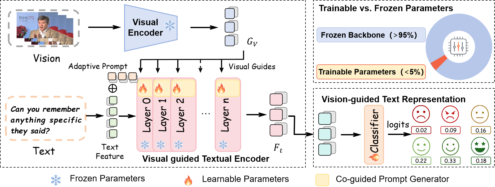

<div align="center">

# VG-TPT

## Vision-Guided Text Prompt Tuning for Multimodal Sentiment Analysis

**Text-centered sentiment modeling with adaptive visual guidance**
</div>

---

<p align="center">
  
</p>

<div align="center">

**VG-TPT** is a parameter-efficient multimodal sentiment analysis framework that  
treats **text as the semantic anchor** and uses **visual facial cues as adaptive affective guidance**.

</div>

> **Core idea:**  
> Text anchors sentiment semantics. Vision calibrates affective ambiguity.  
> Adaptive prompts connect them efficiently.

---

## 🧭 Overview

Multimodal sentiment analysis requires effective modeling of both verbal semantics and non-verbal affective cues.

In many sentiment expressions, **text** provides the primary semantic content, while **visual facial cues** offer complementary evidence for ambiguous, implicit, or conflicting affective signals.

Most existing multimodal methods treat text and vision as parallel streams and combine them through feature-level or decision-level fusion.  
In contrast, **VG-TPT** introduces visual guidance into the internal layers of a frozen BERT encoder through **layer-wise adaptive prompts**, allowing visual information to progressively refine text-centered sentiment representations.

---

## ✨ Highlights

- 📝 **Text-centered sentiment modeling**  
  Text serves as the semantic anchor for multimodal sentiment understanding.

- 👁️ **Controllable visual calibration**  
  Visual facial cues refine ambiguous or implicit text-centered sentiment representations.

- 🧠 **Layer-wise visual-guided prompting**  
  Visual guidance is injected into selected Transformer layers through adaptive prompts.

- 🔀 **Co-guided prompt routing**  
  Prompt routing is conditioned on both the evolving text state and visual affective evidence.

- 🧩 **Adaptive prompt composition**  
  A trainable prompt basis bank enables sample-specific and layer-specific prompt modulation.

- ❄️ **Parameter-efficient tuning**  
  The visual encoder and BERT backbone remain frozen, while only lightweight prompt-related modules are updated.

---

## 🧠 Method at a Glance

VG-TPT contains three key components.

### 1. 📝 Visual-Guided Text Encoding

A frozen visual encoder extracts compact affective guidance from the visual input.

Instead of fusing visual and textual features only at the final representation level, VG-TPT injects visual guidance into selected layers of the textual backbone. This allows visual affective cues to participate in text representation learning throughout the encoding process.

### 2. 🔀 Co-Guided Prompt Routing

At each prompted Transformer layer, the router jointly considers:

- 🧾 the current text state;
- 🎭 the visual guidance feature.

The current text state reflects the evolving semantic representation, while the visual feature provides complementary affective evidence. Together, they guide the selection of suitable prompt bases.

### 3. 🧩 Routing-Guided Adaptive Prompt Composition

VG-TPT maintains a trainable prompt basis bank.

Based on the routing distribution, the model softly activates and combines prompt bases to generate adaptive prompts that are:

- 🎯 **sample-specific**;
- 🪜 **layer-specific**;
- 👁️ **visually guided**.

These adaptive prompts provide a flexible interface for visual calibration of text-centered sentiment representations.

---

## 📊 Results

VG-TPT is evaluated on two widely used multimodal sentiment analysis benchmarks:

- 🎬 **CMU-MOSEI**
- 🎞️ **CMU-MOSI**

### Main Results

| Dataset | Modality | Acc-7 ↑ | Acc-2 ↑ | F1 ↑ | MAE ↓ |
|:--|:--:|--:|--:|--:|--:|
| CMU-MOSEI | V + T | 52.2 | 84.6 | 84.5 | 0.565 |
| CMU-MOSI | V + T | 46.1 | 83.7 | 83.6 | 0.753 |

VG-TPT improves key sentiment prediction metrics while using only visual and textual modalities.

---

## ❄️ Parameter Efficiency

VG-TPT freezes both the visual encoder and the BERT backbone during training.

Only lightweight task-specific modules are updated:

- 🧩 prompt basis bank;
- 🔀 co-guided routing projections;
- 👁️ visual instruction projection;
- 📈 sentiment prediction head.

| Method | Trainable Params | Trainable Ratio |
|:--|--:|--:|
| BERT Full Fine-Tuning | 109M | 100% |
| VG-TPT | 2.4M | 1.2% |

---

## 🚀 Quick Start

Code and detailed reproduction instructions will be released soon.

### ⚙️ Environment Setup

```bash
# Coming soon
```

### 🗂️ Data Preparation

```bash
# Coming soon
```

### 🏋️ Training

```bash
# Coming soon
```

---

## 📚 Citation

The citation information will be updated after the paper is publicly available.

```bibtex
@misc{kou2026vgtpt,
  title  = {Vision-Guided Text Prompt Tuning for Multimodal Sentiment Analysis},
  author = {Kou, Xiaoran and Wu, Jingyi and Sun, Peng and Liu, Yang and Chen, Hong},
  year   = {2026}
}
```

---

## 📬 Contact

Contact information will be updated with the public release.

---

<div align="center">

**VG-TPT**  
*Vision guides prompts. Prompts refine text. Text anchors sentiment.*

</div>
